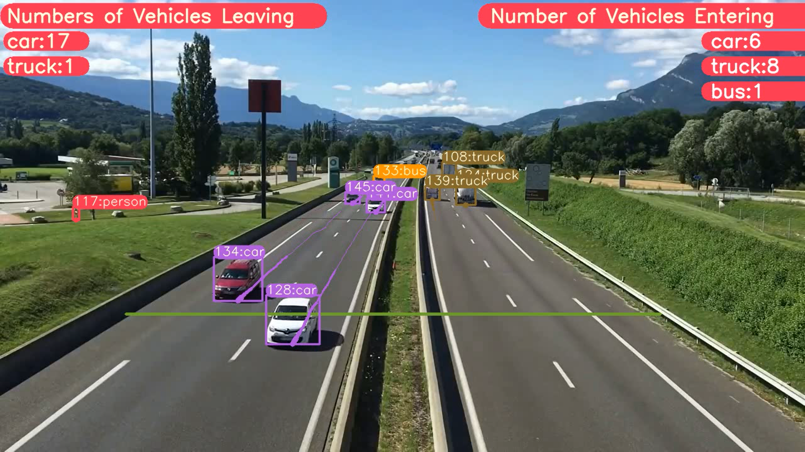

<H1 align="center">
YOLOv7 Object Detection with DeepSORT Tracking(ID + Trails) </H1>

## Google Colab File Link (A Single Click Solution)
The google colab file link for YOLOv7 object detection and tracking is provided below, you can check the implementation in Google Colab, and its a single click implementation, you just need to select the Run Time as GPU, and click on Run All.

[`Google Colab File`](https://colab.research.google.com/drive/1pODFnmwDI4To2bqnyD5OWOYXV8u43iu1?usp=sharing)


## Steps to run Code

- Clone the repository
```
git clone https://github.com/MuhammadMoinFaisal/YOLOv7-DeepSORT-Object-Tracking.git
```
- Goto the cloned folder.
```
cd YOLOv7-DeepSORT-Object-Tracking
```
- Install the dependecies
```
pip install -r requirements.txt

```
- Downloading the Weights  From The YOLOv7 Repo and paste them into the YOLOv7-DeepSORT-Object-Tracking folder
[`Weights File`](https://github.com/WongKinYiu/yolov7/releases/download/v0.1/yolov7.pt)

- Downloading the DeepSORT Files From The Google Drive 
```

https://drive.google.com/drive/folders/1kna8eWGrSfzaR6DtNJ8_GchGgPMv3VC8?usp=sharing
```
- After downloading the DeepSORT Zip file from the drive, unzip it go into the subfolders and place the deep_sort_pytorch folder into the YOLOv7-DeepSORT-Object-Tracking folder

- Downloading a Sample Video from the Google Drive
```
gdown "https://drive.google.com/uc?id=1rjBn8Fl1E_9d0EMVtL24S9aNQOJAveR5&confirm=t"
```

- Run the code with mentioned command below.

- For yolov7 object detection + Tracking
```
python deep_sort_tracking_id.py --weights yolov7.pt  --img 640  --source test1.mp4  
```


### RESULTS

#### Vehicles Detection, Tracking and Counting 


#### Vehicles Detection, Tracking and Counting



